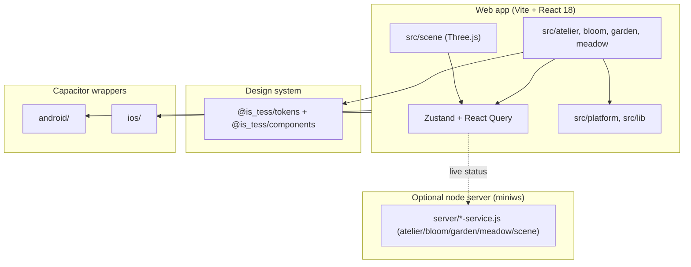
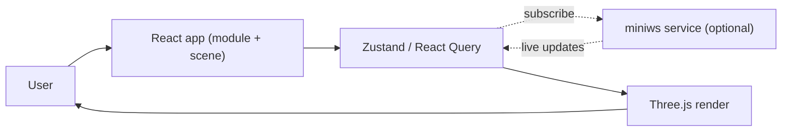

# System Overview — verdant-plant

> Ecosystem node: `verdant-plant`（role: showcase）— 跨專案關係見 platform-command `dashboards/GRAPH.md`；文件慣例見 platform-command `docs/architecture-doc-convention.md`。

Explore Design living lab：以 Vite + React + Three.js 打造的互動展示，消費 `explore-design-sdk` 設計系統，並可打包成 Capacitor 行動 app。

## 元件圖（Components）

## 主要流程（Primary flow）

預設純前端可運作；設定 `HOSTED=1` 時由 `server/` 的 miniws 服務提供 live 狀態（SDK 的 `LiveStatusBadge` / `VirtualList` / `MediaFrame` 為消費範例）。

## 對外整合（Integrations）

- **Design system**：`@is_tess/tokens` + `@is_tess/components`（見 `explore-design-sdk` `verdant.map.json`）。
- **3D**：`three`（`@types/three`）驅動 `src/scene`。
- **Mobile**：Capacitor（`@capacitor/core` + android/ios）打包 `dist/` 為原生殼。
- **Deploy**：Render（Node HOSTED=1）；規劃 SSOT 在 platform-command。

## 邊界與不變式（Boundaries）

- 視覺值走 SDK 語意 token，不在 app 寫死。
- server 為選用 live 層；核心體驗不依賴後端。
- 規劃/路線圖只在 platform-command（本 repo 不放 roadmap SSOT）。

*Created 2026-09-17 — 依 platform-command architecture-doc-convention。*
